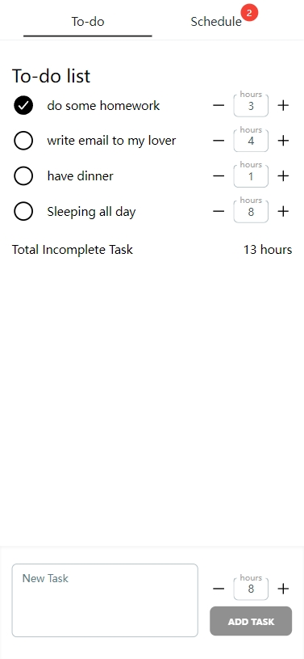
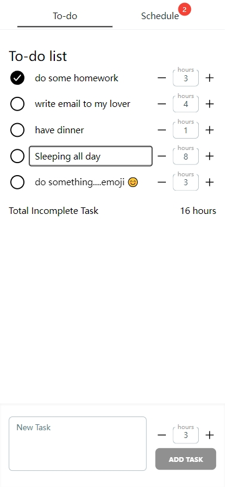

## Getting Started

This project package manager is Yarn. you should install yarn first.

First, run the development server:

```bash
yarn
# then
yarn dev
```

Now dev server run on port 3000

You can preview in url: http://localhost:3000

## Test

If the prompt does not have Jest, please install Jest first.

```bash
yarn add jest ts-jest
```

run test case

```bash
yarn test
```

All APIs are simulated in the background with JSON, and can be dynamically increased or decreased. For details, please refer to /src/pages/api/\*

## Deploy

```
yarn build && yarn start
```

## preview




